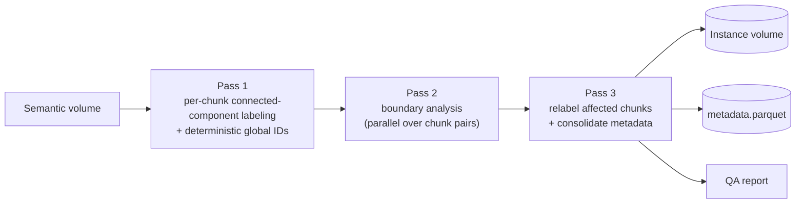
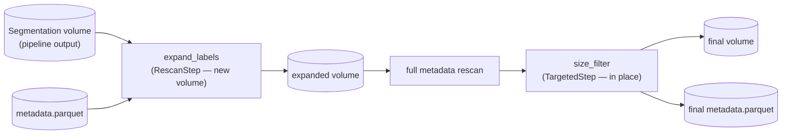

# Chunked Instance Segmentation

chunked-instance-seg is a high-performance pipeline for converting large 3D
semantic segmentations into distinct instance segmentations. Designed
specifically for datasets that are too large to fit into system memory, such as
large Zarr volumes, it processes your data in parallel chunks to deliver fast,
scalable results.

### Key Features

* **Out-of-Core Processing** — safely handle massive volumes by processing and
  saving data in manageable chunks; nothing requires the whole volume in memory
  at once.
* **Highly Parallelized** — optimized for multi-core environments, with both
  process-based (`loky`, the default) and thread-based (`threading`) execution
  supported without any code changes.
* **Fail-Safe & Resumable** — every pass tracks its own progress on disk. If a
  long-running job is interrupted by a crash or timeout, re-running the same
  command picks up exactly where it left off; nothing already computed is
  redone.
* **Built-in Postprocessing** — chainable, scalable steps for label expansion
  and size-based filtering, run against the segmentation pipeline's own output.

## Installation

### Using Pixi (Recommended)

Clone the repository and install dependencies with `pixi`:

```bash
git clone https://github.com/your-org/chunked-instance-seg.git
cd chunked-instance-seg
pixi install
```

### Using Pip

You can also install the repository directly as a Python package:

```bash
pip install git+https://github.com/your-org/chunked-instance-seg.git
```

---

## How It Works

### Pipeline architecture

The volume is tiled into a fixed grid of chunks. Each of the three passes is
parallelized over a different unit of work, and each is independently
resumable — a chunk (or chunk-pair) that already has a completion marker on
disk is skipped on the next run.



1. **Pass 1 (Per-Chunk Segmentation).** Each chunk is thresholded, connected-
   component labeled, and filtered by `min_object_size` independently. Every
   object gets a globally unique ID with no shared counter and no
   cross-worker coordination: the ID is bit-packed from the chunk's own grid
   position plus a chunk-local label (see `IDScheme` in `utils.py`).
2. **Pass 2 (Boundary Analysis).** For every pair of chunks, the two
   one-voxel-thick faces where they touch are compared to find objects that
   are really one object split across the boundary. All boundary pairs are
   then resolved into a single, flattened old-ID → root-ID mapping via graph
   connected-components (not a Python union-find loop), so this stays fast
   even with hundreds of millions of pairs.
3. **Pass 3 (Relabeling & Metadata).** Every chunk touched by the mapping is
   relabeled to its resolved root ID, per-chunk metadata is consolidated into
   one Parquet file, and a summary report is generated.

### QA reports

When `generate_report: true` is set, reports are placed in
`<project_dir>/report/` (or `report_dir`, if set):

* **`report.json`** — total object count, non-empty chunk metrics, and
  summary voxel statistics.
* **`nvoxels_histogram.png`** — log-scale distribution plot of object sizes
  across the volume.

### A known limitation: size filtering happens before merging

`min_object_size` is applied **per chunk, in Pass 1**, before Pass 2 has had a
chance to merge anything across a boundary. An object that is small within
every individual chunk it touches, but would be large once merged, is
filtered out before merging ever sees it — it never gets the chance to grow
into something that would have survived. This is a real, if narrow, trade-off
of processing chunks independently rather than a bug: keeping `chunk_size`
large relative to the objects you expect, and setting `min_object_size`
conservatively (low), avoids most cases of this in practice. If you need this
to never happen, filter downstream instead, using
[`SizeFilterStep`](#step-types) *after* a run with `min_object_size: 0` (or a
low value) — a metadata-only edit, not a full reprocessing.

---

## Pipeline Configuration

The pipeline is run from a single YAML config:

```bash
pixi run python -m source.instance_segmentation_pipeline --config path/to/my_pipeline_config.yaml
```

```yaml
project_dir: /data/my_run
io_func: zarr2                       # storage backend; see DataIO Backends below
semantic_vol: /data/semantic.zarr
instance_vol: instances.zarr         # relative paths resolve under project_dir
chunk_size: [128, 256, 256]
min_object_size: 300
target_label: 1
parallel_backend: loky               # 'loky' (processes, default) or 'threading'
verbose: true
generate_report: true

# Optional. Only applies the FIRST time instance_vol is created -- ignored
# on every subsequent (resumed) run, since the array already exists by then.
zarr_options:
  voxel_size: [30, 10, 10]           # z, y, x, in nanometers
  add_zarr_metadata: true            # write OME-NGFF 0.4 multiscales metadata
  write_empty_chunks: false
```

`metadata_path` and `scratch_dir` default to `<project_dir>/<instance_vol
stem>_metadata.parquet` and `<project_dir>/scratch` respectively, and can be
overridden explicitly (as absolute paths, or relative to `project_dir`).

---

## Postprocessing

The postprocessing module chains steps of two kinds, since they need
different correctness handling:

| Step | Kind | Parameters | What it does |
|:--|:--|:--|:--|
| **`expand_labels`** | `RescanStep` | `distance` (int), `halo` (int, optional — defaults to `distance`) | Grows every label outward by `distance` voxels (haloed, non-overlapping-write chunks to stay correct across boundaries). Because growth can extend an object into a chunk it never touched before, this always writes to a **new** destination and triggers a full metadata rescan afterward. |
| **`size_filter`** | `TargetedStep` | `min_nvoxels` and/or `max_nvoxels` (int) | Drops every object outside the given voxel-count range: zeroes its voxels and removes its metadata row. The edit is exactly known from the *current* metadata, so it's applied **in place** — no rescan needed. |



A rescan runs automatically before the next `TargetedStep` whenever one or
more `RescanStep`s ran before it (and once more at the end, if the volume is
still "dirty" when the chain finishes) — you don't configure this, it's
inferred from the step sequence.

### Postprocessing context is derived from the pipeline run

A postprocessing config does **not** restate `chunk_size`, `stack_dim`,
`scratch_dir`, `parallel_backend`, or `verbose` — every one of those is read
back from the original pipeline run via `pipeline_config`, so the two stay in
sync automatically:

```bash
pixi run python -m source.postprocess_instances --config path/to/my_postprocess_config.yaml
```

```yaml
pipeline_config: /data/my_run/pipeline_config.yaml   # required: the original run's own config
output_vol_path: /data/my_run/instances_clean.zarr   # optional; default: <input name>_<step types>.<ext>
output_metadata_path: /data/my_run/clean_metadata.parquet  # optional; default alongside output_vol_path
allow_overwrite: false                                # in-place edit; only valid for a single step
cleanup_scratch: true                                 # remove intermediate per-step stores on success
n_jobs: -1                                            # independent of the pipeline's own n_jobs
steps:
  - type: expand_labels
    distance: 2
  - type: size_filter
    min_nvoxels: 300
```

`allow_overwrite: true` mutates the original `instance_vol` directly instead
of writing a new file, and is only accepted for a **single-step** run — with
several chained steps, an in-place step's write could otherwise race a later
step's halo read of the same store.

---

## DataIO Backends

Every read/write in both the pipeline and postprocessing goes through the
`DataIO` interface (`source/data_io.py`) — nothing outside that one file
knows or cares which storage backend is behind it. `Zarr2DataIO` is the only
implementation provided. The contract has five members:

* `shape`, `get_data(slice)`, `write_data(data, slice)` — the read/write path.
* `path` — a stable, comparable location for the underlying store (used to
  check "is this the same store as that other one?").
* `open_or_create_like(path, chunk_size=None)` — open-or-create a new store
  of the *same* backend, matching this instance's shape and creation
  settings. This is how postprocessing writes to a fresh destination for each
  chained step without ever naming a concrete backend class.

To support another backend (N5, HDF5, an in-memory array for tests, ...),
write a new `DataIO` subclass implementing all five, and add a branch for it
in `parse_cfg`'s `io_func` dispatch. Nothing in `postprocess_instances.py`
needs to change.

---

## Resumability & Scratch Lifecycle

All intermediate state — pass progress markers, per-chunk metadata, boundary
pair tables, the id mapping, and (for postprocessing) per-step intermediate
stores — lives under `<project_dir>/scratch/`.

* **Interrupted runs.** Re-running any pipeline or postprocessing command
  automatically skips previously completed chunks (or, for postprocessing,
  previously completed steps).
* **Cleanup.** For the main pipeline, pass `delete_scratch: true` in your YAML
  or call `pipeline.cleanup_scratch()` yourself once the final volume and
  Parquet metadata are verified. For postprocessing, intermediate per-step
  stores are removed automatically on success unless `cleanup_scratch: false`
  is set. Either way, cleanup is one-way: it assumes you no longer need to
  resume, and a subsequent run starts from scratch.